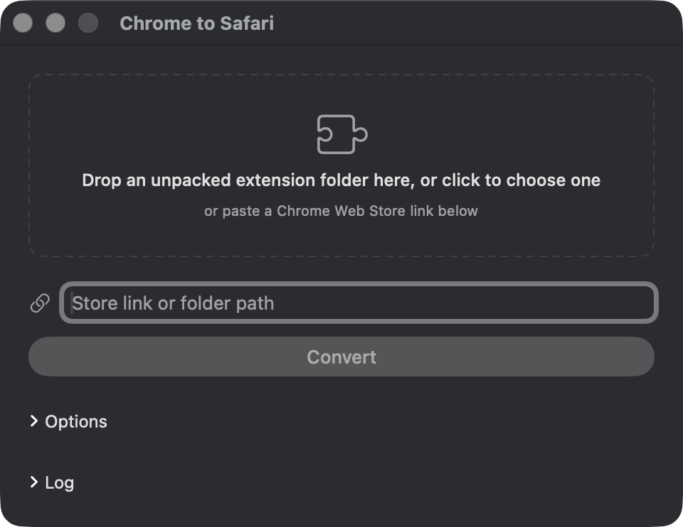

# chrome-to-safari

Turn any Chrome extension (or any WebExtension) into a working, signed Safari extension — **no paid Apple Developer ID required**.

Safari can run Chrome extensions, but unsigned ones get **disabled every time Safari restarts**, so you're forever re-ticking "Allow unsigned extensions" in the Develop menu. This tool signs the extension with a **free** Apple ID, so once you enable it in Safari it stays enabled for good.

## Demo

<video src="docs/ExtensionDemo.mp4" controls muted playsinline width="640">
  Your browser can't play this video inline —
  <a href="docs/ExtensionDemo.mp4">download the demo</a> instead.
</video>

## Quick start

**1. Get a free signing certificate** (one time, about two minutes):

1. Open **Xcode → Settings → Accounts**
2. Click **+** and sign in with your Apple ID — no paid membership needed
3. Select your account → **Manage Certificates…** → **+** → **Apple Development**

**2. Open the app:**

```bash
./chrome-to-safari.sh --ui
```

A window opens. Drop your unpacked extension folder onto it (or click to pick one), **or** paste a Chrome Web Store link, then hit **Convert**. That's it — when it finishes, enable the extension once in **Safari → Settings → Extensions** and you're done.



The app builds itself from [ui.swift](ui.swift) the first time you run `--ui`, using the Xcode tools you already have. Nothing is downloaded, so there are no Gatekeeper warnings. The **Options** section is optional — leave every field blank and it picks sensible defaults.

## Command line

Prefer the terminal? Point the script straight at a folder or a store link:

```bash
# A local unpacked extension folder
./chrome-to-safari.sh /path/to/extension

# A Chrome Web Store link (downloaded and unpacked for you)
./chrome-to-safari.sh "https://chromewebstore.google.com/detail/<name>/<id>"

# Convert and build, but don't install to /Applications
./chrome-to-safari.sh /path/to/extension --build-only
```

Each run converts the extension, builds the wrapper app, signs it, installs it to `/Applications`, and opens Safari.

## Requirements

- macOS with **Xcode** installed (the full app, not just Command Line Tools — the converter and build need it)
- A free Apple Development certificate (the one-time step above). The script auto-detects it on every run; if it's missing, it stops and prints these same instructions.

### Options (environment variables)

These match the **Options** section in the app. All optional.

| Variable    | Default                              | Purpose                          |
|-------------|--------------------------------------|----------------------------------|
| `APP_NAME`  | `"name"` field from `manifest.json`  | Display name of the wrapper app  |
| `BUNDLE_ID` | `com.converted.<slug>`               | Bundle identifier                |
| `TEAM_ID`   | auto-detected from your keychain     | Apple team ID (if you have several certificates) |
| `OUT_DIR`   | `<extension-parent>/<slug>-safari`   | Where the Xcode project and build output go |

Example:

```bash
APP_NAME="My Cool Extension" BUNDLE_ID=com.me.coolext ./chrome-to-safari.sh ./my-extension
```

## What it does, step by step

1. **Downloads the extension first, if you gave it a store link.** It pulls the `.crx` from Google's own update endpoint (the same one Chrome uses), unpacks it, and strips the store's `_metadata` folder. Note: fetching a `.crx` outside Chrome is technically against the Web Store terms — fine for converting an extension for your own use, but know that's what's happening.
2. **Reads `manifest.json`** to name the app (handles `__MSG_*__` i18n placeholders by falling back to the folder name).
3. **Converts** with Apple's `xcrun safari-web-extension-converter`, copying your extension's resources into a fresh Xcode project.
4. **Fixes a converter quirk**: the generated app and extension targets can end up with mismatched bundle identifiers, which breaks the build with *"Embedded binary's bundle identifier is not prefixed with the parent app's bundle identifier"*. The script normalizes the extension ID to `<app ID>.Extension`.
5. **Builds** with `xcodebuild`, injecting your team ID so both targets are signed with your free Apple Development certificate.
6. **Verifies** the code signature.
7. **Installs** the app to `/Applications`, registers it with Launch Services, and launches it plus Safari.
8. **Cleans up after itself**: once the app is in `/Applications`, the generated Xcode project and build tree are deleted so you don't end up with duplicate copies of the extension. Pass `--build-only` if you want to keep them.

Re-running the script is safe: it re-converts and rebuilds from scratch each time, so just run it again after changing your extension's source.

## Limitations

- **Signing is per-machine.** A development-signed app only counts as signed on the Mac that built it. You can't distribute the built app to other people — they should clone your extension's source and run this script themselves. Public distribution requires a paid Apple Developer account and notarization; nothing scriptable gets around that.
- **Not every Chrome API exists in Safari.** The converter warns about unsupported `manifest.json` keys during conversion — read its output. Check [Safari's WebExtension API support](https://developer.apple.com/documentation/safariservices/safari_web_extensions) for details.
- **Free certificates expire after about a year.** Re-run the script to re-sign when that happens.

## Troubleshooting

- **"No Apple Development certificate found"** — do the one-time setup above.
- **Extension doesn't appear in Safari** — quit and reopen Safari, then check Safari → Settings → Extensions. Make sure the wrapper app ran at least once.
- **Multiple certificates / wrong team** — pass `TEAM_ID=XXXXXXXXXX` explicitly. Find yours with `security find-identity -v -p codesigning`.

## License

MIT — see [LICENSE](LICENSE).
